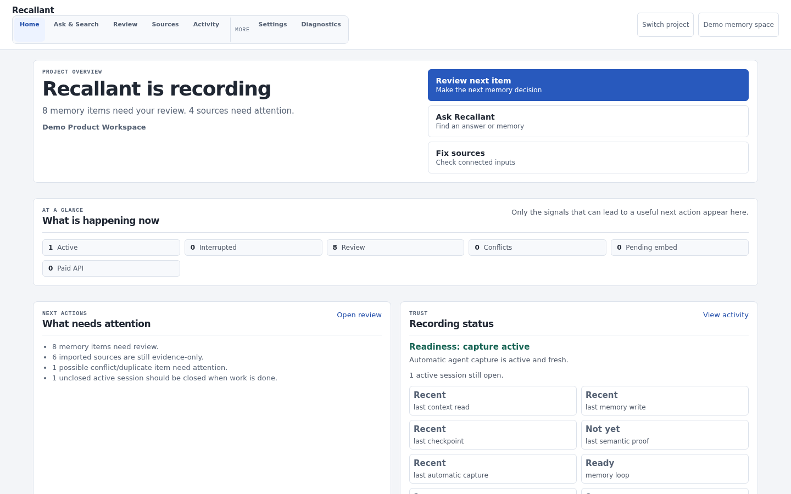
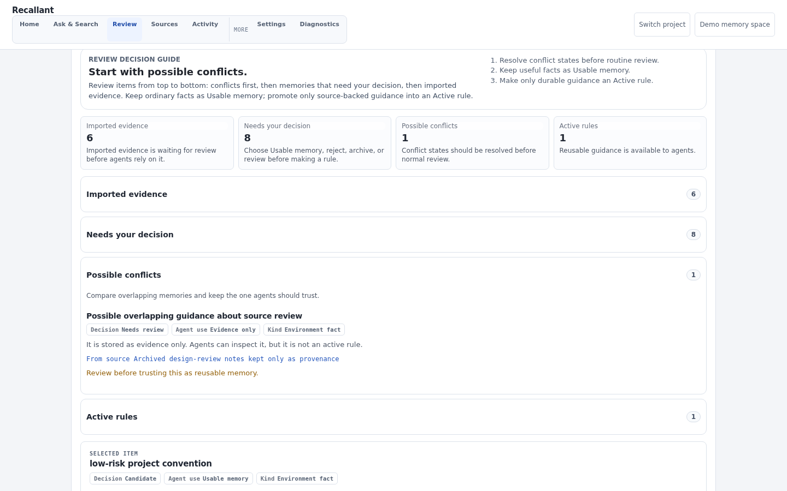
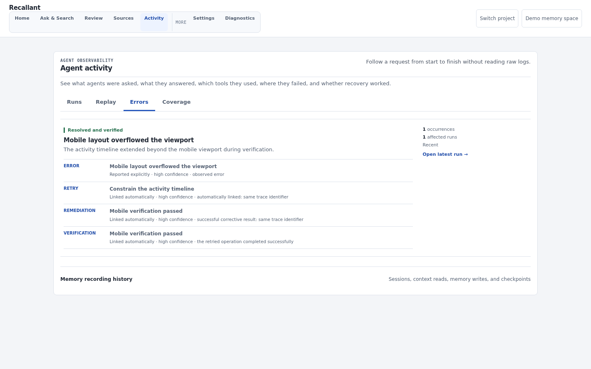
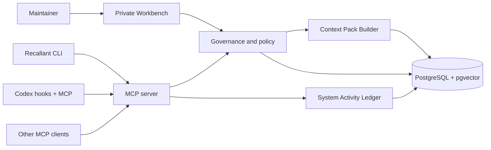

# Recallant

[](https://github.com/Mushkrot/Recallant/actions/workflows/ci.yml)

**Self-hosted governed project memory for coding agents.**

Recallant lets an agent resume project work from scoped, source-backed context while keeping the
maintainer in control of what becomes reusable memory or instruction-grade guidance. It records
decisions, checkpoints, evidence, review state, and agent activity in PostgreSQL with pgvector.

The problem is familiar: useful context is scattered across chat history, terminal output, notes,
pull requests, and somebody's memory. Saving all of it as a transcript creates a different problem.
Old guesses look authoritative, project boundaries blur, and nobody can explain why a rule exists.
Recallant keeps evidence, governed memory, and active rules separate.

Built with TypeScript, PostgreSQL/pgvector, a CLI, MCP, and a private browser Workbench.
It is a development prerelease with a Codex-first workflow.

To evaluate the core idea, [onboard one project](docs/QUICKSTART.md), record a decision,
close the session, and retrieve its source-backed context in a new session. Review controls
determine which memories can become active guidance.

## See It Working

These screenshots come from the real private Workbench with deterministic synthetic data. The
[generator](docs/assets/workbench/README.md) runs the same browser fixture used for Playwright
acceptance testing.

These previews use a documentation-only palette; the installed application's theme may differ.

**Home shows whether capture and the governed memory loop are actually active.**



**Review keeps a proposed memory tied to its source and asks for an explicit decision.**



**Activity connects an observed failure to retry, remediation, and successful verification.**



## What Ships Today

- **One onboarding path.** `recallant onboard <project>` uses reachable local storage or scoped
  remote access supplied by project configuration, deployment environment, or `--server-url`. If
  neither route is configured, it stops before changing project files and shows the setup choices.
- **Durable agent lifecycle.** MCP and CLI paths cover session start, bounded Context Packs, event
  capture, governed memory, checkpoints, closeout, and next-session recall.
- **Review before authority.** Memories retain provenance, scope, status, confidence, and source
  references. An agent-authored fact does not silently become a binding rule.
- **Private Workbench.** Home, Ask & Search, Review, Sources, Activity, Settings, and Diagnostics give
  maintainers a human control surface for memory and capture health.
- **Observable agent work.** Run replay, grouped errors, recovery chains, capture coverage, and a
  redacted System Activity Ledger make failures and gaps inspectable without keeping a second raw
  transcript.
- **Private-by-default operations.** Local MCP, authenticated scoped remote MCP, backup and restore,
  explicit cleanup, secret references, and confirmation gates keep sensitive actions server-side.
- **Local-first routing.** Embeddings can run through a local deterministic or Ollama route. Paid
  providers require an explicit governed capability and approval.

## The Memory Contract

Recallant does not give every stored sentence the same authority. The write path preserves three
useful distinctions:

1. **Evidence** records what happened or what an approved source contained. Agents may inspect it,
   but it cannot act as a rule.
2. **Usable memory** holds a reviewed fact, decision, lesson, action, or checkpoint that may help
   later work inside its declared scope.
3. **Active rules** contain durable guidance that an authorized human promoted from source-backed
   memory. Agent inference alone cannot create one.

At session start, the server builds a bounded Context Pack from the current checkpoint, accepted
rules, relevant project memories, and recovery state. Deeper evidence stays available through
search instead of being pushed into every prompt. Cross-project examples require an explicit query
and stay labeled as examples until they are adopted in the current project. This keeps the startup
context small and makes the answer to “why does the agent believe this?” inspectable.

## Architecture

Recallant has one authority for project identity, memory, provenance, lifecycle, and policy. Agent
clients contribute evidence through MCP. The Workbench reads and changes governed state through the
same service boundary.



The detailed [architecture](docs/ARCHITECTURE.md) covers project bootstrap, write and read paths,
the governed graph, agent observations, remote access, data lifecycle, and safety boundaries.

## Quickstart

For a local single-user evaluation, preview the installer if you want to inspect its plan:

```bash
curl -fsSL https://raw.githubusercontent.com/Mushkrot/Recallant/main/scripts/install-recallant-bootstrap.sh \
  | bash -s -- --dry-run
```

Install the local service, then onboard a project:

```bash
curl -fsSL https://raw.githubusercontent.com/Mushkrot/Recallant/main/scripts/install-recallant-bootstrap.sh | bash
recallant onboard /path/to/project
```

For a pinned prerelease, use the versioned command after the tag is published:

```bash
curl -fsSL https://raw.githubusercontent.com/Mushkrot/Recallant/v0.1.0-dev.1/scripts/install-recallant-bootstrap.sh \
  | bash -s -- --ref v0.1.0-dev.1
```

Tagged installs remain on that prerelease channel during onboarding. Switching to the moving
development channel requires an explicit reinstall with `--ref main`.

The local self-host path may require Docker and PostgreSQL. On a workstation connected to an
existing Recallant server, use the same `recallant onboard <project>` command with that server URL
provided by project configuration, deployment environment, or `--server-url`, rather than
installing a second storage stack. See the [Quickstart](docs/QUICKSTART.md) for prerequisites,
dry-run behavior, expected readiness proof, rollback, and remote setup.

Onboarding aims to prove more than configuration. A healthy run distinguishes access, context read,
semantic recall, memory-loop readiness, and fresh automatic capture. It prints the exact missing
proof when one of those states is incomplete.

## Current Scope and Limits

Recallant `v0.1.0-dev.1` is a **development prerelease**, not stable production software. It is
suitable for local evaluation and controlled development use. Broader project pilots, native
cross-client parity, and stable support guarantees are still open work.

Native automatic capture is **Codex-first today**. Claude Code, Cursor, Windsurf, and generic MCP
clients can be configured to use the shared MCP service, but configuration does not prove equivalent
native capture. Real bidirectional Codex to Claude Code to Codex continuity, with no pasted human
recap, is the next product milestone.

Recallant can attach governed sources and preserve imported evidence now. It does not yet provide a
general human document workspace, unrestricted folder crawling, passive Obsidian synchronization,
or production-ready chat over arbitrary PDF and DOCX collections. See [Current Status](docs/STATUS.md)
and the [Roadmap](docs/ROADMAP.md) for the maintained boundary.

The four ordered milestones are Cross-Client Continuity, Human Document Memory, a Recallant-owned
Task Handoff Record, and then broader human-memory sources and connectors. Shipped graph and
observability capabilities remain supported, but further expansion follows those product proofs.

## Engineering Evidence

CI runs formatting, lint, TypeScript builds, dependency audits, public security checks, database
integration, lifecycle and onboarding acceptance, Workbench smokes, and Playwright browser tests.
The browser fixture checks desktop and mobile layouts, required navigation, clipped controls,
horizontal overflow, console errors, page errors, and failed requests.

For an ordinary change, start with:

```bash
npm run format:check
npm run lint
npm run build
npm run public-readiness:smoke
npm run public-security:smoke
```

Focused commands and the full contributor workflow are documented in
[CONTRIBUTING.md](CONTRIBUTING.md).

For code reviewers, start with [contracts](packages/contracts/src),
[memory policy and redaction](packages/core/src), [MCP tools](packages/mcp/src/tools.ts),
and the [storage schema](packages/db/migrations/0001_initial.sql).
The [architecture guide](docs/ARCHITECTURE.md) connects those components to the CLI and Workbench.

MCP can expose a skeleton mode when no database is configured. Its stub responses are intended
for protocol development; evaluating durable memory requires the database-backed setup above.

## Documentation

- Evaluate: [Quickstart](docs/QUICKSTART.md), [Current Status](docs/STATUS.md), and
  [Product Contract Status](docs/CONTRACT_STATUS.md).
- Use: [Client Setup](docs/CLIENT_SETUP.md), [Workbench UI](docs/WORKBENCH_UI.md), and
  [Agent-Ready Projects](docs/AGENT_READY_PROJECTS.md).
- Operate: [Self-Hosting](docs/SELF_HOSTING.md), [Operations Runbook](docs/RUNBOOK.md), and
  [Security](docs/SECURITY.md).
- Understand: [Architecture](docs/ARCHITECTURE.md), [Domain Language](CONTEXT.md),
  [Agent Observability](docs/AGENT_OBSERVABILITY.md), and [Why Recallant](docs/WHY_RECALLANT.md).
- Explore secondary design context: [Comparisons](docs/COMPARISON.md) and
  [Research Notes](docs/research/README.md).

The full curated route is in the [documentation index](docs/README.md).

## License

Apache License 2.0. See [LICENSE](LICENSE).
