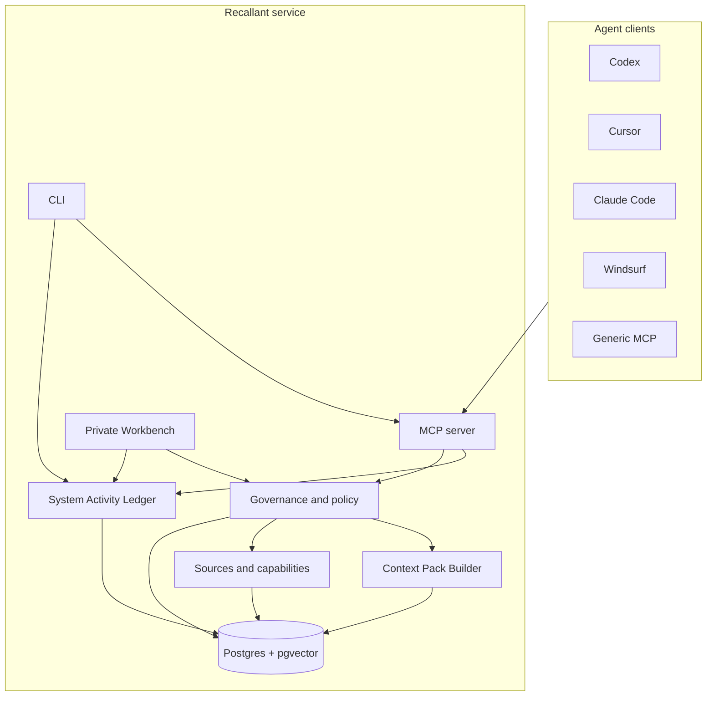

# Architecture

Recallant is a self-hosted memory service for AI development agents. It is built around a simple
idea: agents should remember useful project context, but remembered context needs provenance, scope,
review state, and safety policy.

## System Overview

## Core Concepts

- **Memory space:** a logical project or topic boundary. A memory space may be backed by a folder,
  repository, document set, connector, or manual topic.
- **Source:** the thing a memory refers to: project files, repo metadata, session events, imported
  documents, or future connector records.
- **Capability reference:** a governed record that a project can use an external service, private
  deployment profile, connector, or server inventory entry without storing raw credentials.
- **Secret reference:** a variable name, secret-store label, or configuration handle. The secret
  value stays outside Recallant memory.
- **Raw evidence:** bounded records of what happened during work.
- **System activity event:** a redacted operational record that an owner can use to audit surfaces,
  operations, status, timing, trace ids, and health without storing raw request bodies or secrets.
- **Governed memory:** a durable, reviewable fact, decision, rule, lesson, or checkpoint derived
  from evidence.
- **Context pack:** a bounded startup bundle built by the server for the current task.

## Project Bootstrap

`recallant onboard <project>` is the product-level path for making a project agent-ready. It owns
storage readiness, project attach, client connection, capture proof, recall proof, and Workbench
visibility. Under the hood it creates or updates thin local pointers such as `.recallant/config`,
`AGENTS.md`, `PROJECT_LOG.md`, and client MCP configuration while keeping durable history in
Recallant.

For existing projects, onboarding treats old handoffs, runbooks, and agent files as migration
inputs. Useful material is imported as source-linked evidence or reviewable memory candidates; long
history does not belong in startup files.

## Write Path

Agents append workflow evidence through MCP or CLI fallback commands. Recallant stores the event,
attaches source references, chunks/indexes searchable content, and may create governed memories when
policy allows it.

Instruction-grade rules require stronger authority than ordinary agent inference. A memory can be
useful without becoming a binding instruction.

## Read Path

At session start, agents call `memory_start_session` and then `memory_get_context_pack`. The Context
Pack Builder combines:

- current checkpoint;
- relevant accepted rules;
- project-scoped working memories;
- recovery warnings;
- bounded evidence when useful;
- suggested follow-up searches.

Search and recall remain scoped by default. Cross-project examples can be requested, but they are
labeled as examples/evidence unless explicitly adopted in the current project.

## Safety Model

Recallant keeps safety decisions server-side:

- secrets are stored as references, not raw values;
- capability and connector bindings require governed setup;
- destructive actions require confirmation;
- paid APIs are disabled or confirmation-gated by default;
- Ollama cloud tags and other external model routes are governed capabilities, not local fallback
  models;
- public exposure is explicit deployment work, not a default mode;
- browser clients must not receive provider keys or raw secret values;
- recalled text is treated as untrusted evidence until policy promotes it.

## System Activity Ledger

The system activity ledger is the observability layer for Recallant itself. CLI commands, MCP tool
calls, Workbench HTTP routes, model/capture signals, settings changes, and project cleanup paths can
write redacted activity rows with a shared trace id model. The ledger is used by `recallant audit`
and the Workbench Audit view.

This is not a raw traffic log and not a full SIEM integration. It stores bounded, owner-readable
metadata: surface, operation, status, timing, trace ids, project/session links when allowed, error
codes, and redacted details. It must not store request bodies, auth headers, cookies, raw
environment values, provider keys, database URLs, or secret-like values.

Lifecycle operations treat the ledger as governance evidence. Backups include it so a restored
instance can explain what happened. Project purge counts matching ledger rows during dry-run and
then de-identifies them during confirmed purge, retaining only a redacted audit trail.

## Deployment Shape

Recallant can run as a single-user local service or a managed Linux service. The public default is
private-by-default self-hosting:

- local MCP stdio for agents;
- private Workbench for humans;
- Postgres/pgvector storage;
- explicit install profiles;
- private deployment profiles represented as configuration and capability references;
- rollback and detach workflows that avoid deleting memory by accident.

Protected public Workbench access is a human management path, not the same thing as remote agent
access. The default agent path remains local stdio MCP on an installed host. Recallant also includes
a first authenticated remote endpoint slice, where `POST /api/mcp` accepts scoped JSON-RPC
`initialize`, `tools/list`, and `tools/call` requests through DB-backed remote MCP credentials
without giving remote clients direct Postgres access and without exposing admin APIs, raw artifacts,
backups, or provider settings anonymously.

That remote path must preserve the same project/developer scope, context-pack, capture, review, and
safety policies as local stdio MCP. Remote MCP credentials are project/developer scoped, optionally
client scoped, revocable, rotatable, hash-stored, and audited with credential id/prefix metadata
only. The universal remote-connect architecture is device-style pairing: the external machine starts
a pending connection from `curl -fsSL https://memory.example.com/connect | bash`, the owner approves
through the protected central server, and the server creates the project binding plus scoped remote
MCP credential. First approval can register a local trusted-device public key; later projects from
that workstation use signed nonce challenges instead of another Cloudflare browser approval.
Headless hosts use short-lived one-time bootstrap tokens. Generated project config points to a
local credential-store reference instead of embedding the raw scoped credential. Remote onboarding
invites are also hash-stored and one-time; redeeming an invite creates the scoped remote MCP
credential and writes the project-local remote bridge config, but invites are the advanced/admin
path rather than the universal first-run command. The implementation record and operating contract
are in `docs/REMOTE_CONNECT_PLAN.md`. The endpoint behavior is gated by
`remote-mcp-contract:smoke` and `remote-mcp-credentials:smoke`;
`remote-mcp-bridge:smoke`, `remote-mcp-provisioning:smoke`, `remote-mcp-doctor:smoke`,
`remote-mcp-security:smoke`, and `remote-mcp-external-rehearsal:smoke` cover the bridge,
provisioning, invite redemption, diagnostics, security matrix, deterministic isolated
external-client rehearsal, and `remote-mcp-separate-machine-evidence:smoke` covers the redacted
evidence bundle shape for the real external-host gate. A real external Mac rehearsal passed on
2026-06-20 with redacted evidence run `c01ae9a7-a60c-4e12-bedf-d4be222c58b0` and strict server-side
verification of next-session recall, Workbench readiness, and redacted audit rows; repeat
rehearsals and broader transport/client support remain near-term work.

## Why This Is Different From Plain Logs Or RAG

Logs are useful evidence, but they do not know which statements are still valid, which project they
apply to, who should consume them, or whether they can act as future instructions. Recallant keeps
those distinctions in the product model instead of leaving every agent to guess.
