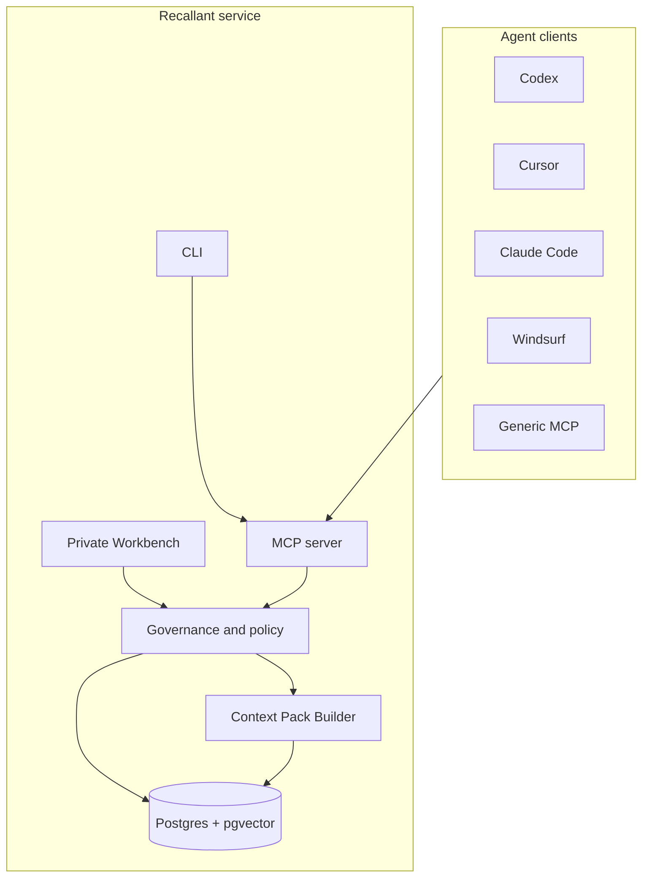

# Architecture

Recallant is a self-hosted memory service for AI development agents. It is built around a simple
idea: agents should remember useful project context, but remembered context needs provenance, scope,
review state, and safety policy.

## System Overview

## Core Concepts

- **Memory space:** a logical project or topic boundary. A memory space may be backed by a folder,
  repository, document set, connector, or manual topic.
- **Source:** the thing a memory refers to: project files, repo metadata, session events, imported
  documents, or future connector records.
- **Raw evidence:** bounded records of what happened during work.
- **Governed memory:** a durable, reviewable fact, decision, rule, lesson, or checkpoint derived
  from evidence.
- **Context pack:** a bounded startup bundle built by the server for the current task.

## Write Path

Agents append workflow evidence through MCP or CLI fallback commands. Recallant stores the event,
attaches source references, chunks/indexes searchable content, and may create governed memories when
policy allows it.

Instruction-grade rules require stronger authority than ordinary agent inference. A memory can be
useful without becoming a binding instruction.

## Read Path

At session start, agents call `memory_start_session` and then `memory_get_context_pack`. The Context
Pack Builder combines:

- current checkpoint;
- relevant accepted rules;
- project-scoped working memories;
- recovery warnings;
- bounded evidence when useful;
- suggested follow-up searches.

Search and recall remain scoped by default. Cross-project examples can be requested, but they are
labeled as examples/evidence unless explicitly adopted in the current project.

## Safety Model

Recallant keeps safety decisions server-side:

- secrets are stored as references, not raw values;
- destructive actions require confirmation;
- paid APIs are disabled or confirmation-gated by default;
- public exposure is explicit deployment work, not a default mode;
- browser clients must not receive provider keys or raw secret values;
- recalled text is treated as untrusted evidence until policy promotes it.

## Deployment Shape

Recallant can run as a single-user local service or a managed Linux service. The public default is
private-by-default self-hosting:

- local MCP stdio for agents;
- private Workbench for humans;
- Postgres/pgvector storage;
- explicit install profiles;
- rollback and detach workflows that avoid deleting memory by accident.

## Why This Is Different From Plain Logs Or RAG

Logs are useful evidence, but they do not know which statements are still valid, which project they
apply to, who should consume them, or whether they can act as future instructions. Recallant keeps
those distinctions in the product model instead of leaving every agent to guess.
