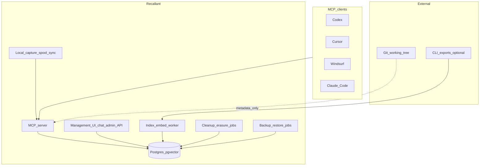
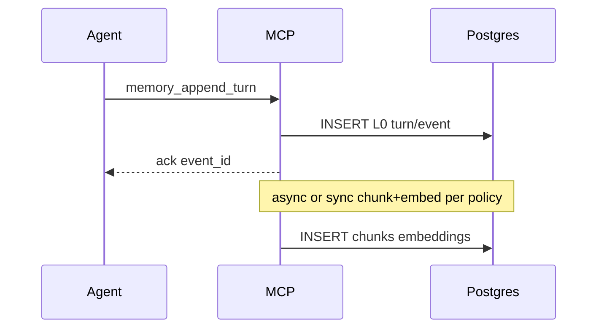
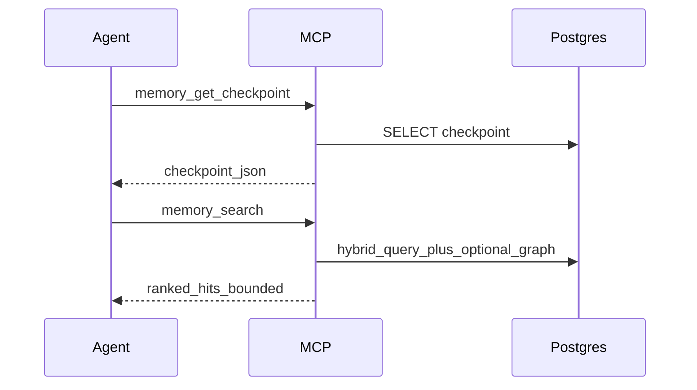
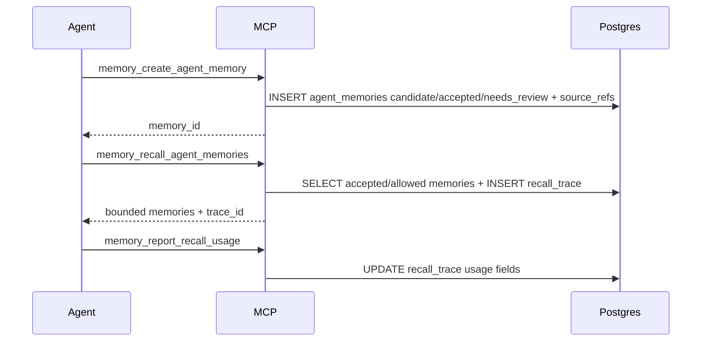
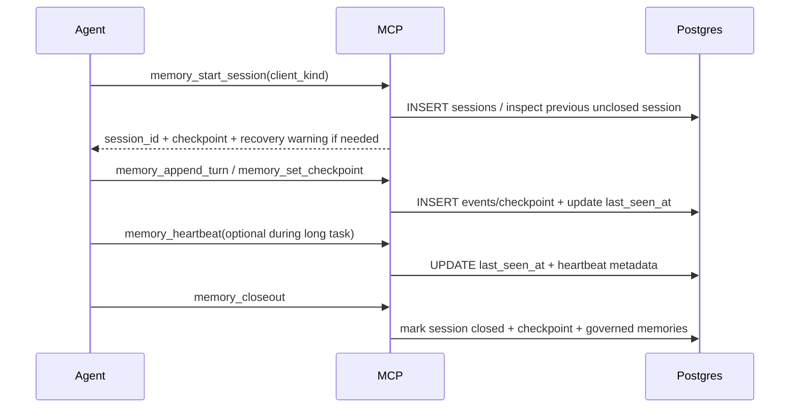
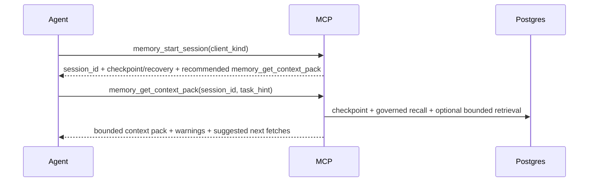

# Architecture

## 0. Current architecture bias

Recallant uses **Open Brain / OB1 as the preferred architectural foundation**: Postgres/pgvector, remote MCP, multi-client memory, and governed agent-memory sidecars are the default starting point. This is a working direction, not a claim that every OB1 detail should be copied unchanged.

The accepted direction is now an **OB1/MF0 synthesis**: OB1 supplies the governance backbone, while MF0 supplies important workbench/raw-capture/Memory Tree/Keeper ideas. Recallant owns the integration layer: managed hybrid capture, raw workflow evidence, project capture profiles, Review UI, context budget, and local-server-first deployment. See [ADR-0018-ob1-mf0-synthesis.md](ADR-0018-ob1-mf0-synthesis.md) and [ADR-0027-raw-workflow-evidence-foundation.md](ADR-0027-raw-workflow-evidence-foundation.md).

Other reviewed systems remain active inputs:

- MemPalace for verbatim capture, hooks/sweep, temporal KG, hybrid retrieval, and recovery posture.
- MF0-1984 for workbench/Memory Tree UX, graph hygiene, keeper pipelines, and export/import patterns.
- OpenMemory for salience/decay/reinforcement, temporal facts, connectors, and explainable recall traces.
- Journey / Journey Kits for packaging reusable workflows, install targets, preflight checks, resolver hints, shared context, and outcome/learning loops.

See [ADR-0004-ob1-as-preferred-foundation.md](ADR-0004-ob1-as-preferred-foundation.md), [ADR-0018-ob1-mf0-synthesis.md](ADR-0018-ob1-mf0-synthesis.md), and [UPSTREAM_INTEGRATION.md](UPSTREAM_INTEGRATION.md).

Codex is the first adapter and tested workflow, but Recallant is not Codex-specific. The core MCP tools, session lifecycle, closeout, recovery, storage, and Review UI are universal. See [ADR-0019-universal-mcp-core-codex-adapter-session-recovery.md](ADR-0019-universal-mcp-core-codex-adapter-session-recovery.md).

Review UI runs on the Recallant server. v1 uses a compact private workbench, not a minimal approval table, and the architecture should let it grow into a fuller management platform and later be exposed through a dedicated Cloudflare-managed subdomain if the owner chooses. See [ADR-0020-review-ui-on-recallant-server-management-platform-path.md](ADR-0020-review-ui-on-recallant-server-management-platform-path.md) and [ADR-0033-compact-review-ui-workbench-in-v1.md](ADR-0033-compact-review-ui-workbench-in-v1.md).

Settings live centrally on the Recallant server. Project repositories keep only pointer/config files; effective policy is resolved from session/project/developer/server settings. v1 exposes a controlled Settings UI for project workflow settings while keeping sensitive/server settings read-only or confirmation-gated. See [ADR-0022-centralized-settings-on-recallant-server.md](ADR-0022-centralized-settings-on-recallant-server.md), [ADR-0034-controlled-settings-ui-in-v1.md](ADR-0034-controlled-settings-ui-in-v1.md), and [SETTINGS.md](SETTINGS.md).

Model routing is local-first, subscription-first, and API-last with a configurable provider portfolio. The baseline profile uses local Ollama models for routine work, active-agent/subscription-backed routes for stronger reasoning where available, and OpenAI/Gemini/Claude paid API routes only after explicit approval by default. See [ADR-0023-baseline-model-portfolio-and-provider-switching.md](ADR-0023-baseline-model-portfolio-and-provider-switching.md), [ADR-0031-subscription-first-api-last-model-escalation.md](ADR-0031-subscription-first-api-last-model-escalation.md), [ADR-0032-paid-api-confirmation-and-cost-dashboard.md](ADR-0032-paid-api-confirmation-and-cost-dashboard.md), and [MODEL_ROUTING.md](MODEL_ROUTING.md).

Startup context is built automatically by the server-side Context Pack Builder through `memory_get_context_pack`, not by a manual UI button. See [ADR-0024-automatic-startup-context-pack-builder.md](ADR-0024-automatic-startup-context-pack-builder.md) and [CONTEXT_BUDGET.md](CONTEXT_BUDGET.md).

Environment discovery and portability are first-class architecture requirements. Recallant must model server/project/secret/connector reality as configurable facts, not hard-coded paths, and must support export/restore/remapping when moving to another server. See [ADR-0038-environment-discovery-and-portable-instance.md](ADR-0038-environment-discovery-and-portable-instance.md).

Import workflow is discovery-first and import-by-confirmation. `recallant discover` finds candidates, `recallant init` registers/configures projects and suggests imports, and `recallant import` performs explicit preview/dry-run/write flows. See [ADR-0039-v1-import-workflow.md](ADR-0039-v1-import-workflow.md) and [IMPORT_POLICY.md](IMPORT_POLICY.md).

Memory applicability uses a multi-axis scope/audience model: `scope_kind`/`scope_id` define where a memory applies, `audience` defines who may consume it, and `use_policy` defines authority. Conflict resolution applies applicability, authority, scope specificity, and recency in that order. See [ADR-0040-memory-scope-and-audience-model.md](ADR-0040-memory-scope-and-audience-model.md) and [ADR-0041-conflict-resolution-priority.md](ADR-0041-conflict-resolution-priority.md).

Recallant is a managed AI-native platform. The owner-facing management surface includes Review UI, controlled settings, Cost / Paid API, health/doctor status, cleanup, and natural-language chat. AI can propose extraction, cleanup, conflict explanations, and context plans, but deterministic server policy owns auth, storage, caps, audit, confirmation, and destructive operations. See [ADR-0042-managed-ai-native-platform-and-operations.md](ADR-0042-managed-ai-native-platform-and-operations.md) and [OPERATING_PRINCIPLES.md](OPERATING_PRINCIPLES.md).

Managed memory includes explicit erasure. Archive/reject/supersede are normal governance actions; "forget forever" is a separate owner-confirmed workflow that removes target content and derived material from active recall, embeddings, summaries, context packs, search indexes, and UI surfaces.

Scope boundary is explicit: v1 is the full working coding-agent memory core; broader personal-life capture, external connectors, specialized storage systems, and public packaging are future expansion paths. See [ADR-0025-v1-core-and-expansion-boundary.md](ADR-0025-v1-core-and-expansion-boundary.md).

Implementation is not authorized yet. Architecture documentation remains the current deliverable; see [ADR-0009-documentation-first-before-implementation.md](ADR-0009-documentation-first-before-implementation.md).

## 1. System context

## 2. Component responsibilities

| Component | Responsibility |
|-----------|----------------|
| **MCP server** | The required agent-facing v1 interface: tools from `MCP_SPEC.md`, authz by `project_id`, validation, bounded responses, and governed-memory policy enforcement. |
| **Postgres** | Source of truth: L0 events/turns/workflow evidence metadata, raw artifact pointers, L1 chunks/embeddings, L2 edges, L3 governed agent memories, checkpoints, recall traces, settings, and erasure receipts. Migrations are versioned. |
| **Index/embed worker** | Async processing: chunking, embedding, rerank when not inline, and reindex. It may run inside MCP for the simplest v1 path or as a separate process when load justifies it. |
| **Management UI + admin API** | Required owner-facing v1 surface for governed-memory review, inbox, rules, detail/source refs, duplicates, conflicts, Cost / Paid API, settings, health, cleanup, and natural-language management chat. It must use the same policy path as MCP/CLI actions. |
| **Management UI path** | Starts as a compact Recallant private workbench; can later expand into management surfaces for projects, capture profiles, sessions/recovery, sync/spool state, model routing, cleanup, backup status, and other admin functions. |
| **Auth/access layer** | Private-by-default access control for Review UI/admin API/remote MCP: localhost/Tailnet bind by default, Recallant auth/session/token, secret isolation, and Cloudflare-ready routing without public exposure by default. |
| **Settings service** | Resolves effective settings from session overrides, project settings, developer/global defaults, server settings, and built-in defaults; exposes inspected effective settings to UI/CLI/MCP policy paths. |
| **Context Pack Builder** | Server-side startup context builder used by agents automatically after `memory_start_session`; composes checkpoint, rules, governed memories, recovery state, optional evidence, and next-fetch hints under context policy. |
| **Cleanup / erasure jobs** | Analyze stale/duplicate/conflicting/low-value memory, propose cleanup clusters, archive/rebuild derived data, prune confirmed synced spool, and execute owner-confirmed permanent erasure with redacted receipts. |
| **Natural-language management interpreter** | Converts owner chat requests into read-only answers, proposed action plans, or confirmation-gated actions. It may use model routing, but execution happens through normal server-side policy and audit paths. |
| **Backup/restore jobs** | Create Postgres/raw-artifact backups, write manifests, support encrypted local target first, allow future second-server replication, and verify restore into temporary DB/location. |

## 3. Data flow (write path)

Sync/async embedding policy is fixed by implementation profile. The normal v1 direction is a minimal synchronous acknowledgement path that returns `event_id` quickly while chunking/embedding happens in the same transaction or immediately after with explicit `pending_embed` status.

## 4. Data flow (read path)

## 4.1 Governed memory path

Policy lives in the MCP server, not in the client prompt. The server must prevent agent-generated records from silently becoming instruction-grade memory.

## 4.2 Session lifecycle and recovery

If the agent stops before `memory_closeout`, the next `memory_start_session` surfaces the unclosed session and last durable state. Hybrid heartbeat improves long-task status but is not required for basic clients. This is core Recallant behavior, not a Codex-only feature.

## 4.3 Startup context pack

This is the normal startup path. CLI/UI may preview the same pack, but they must not implement a separate context-selection algorithm.

## 5. Multi-project routing

- Every MCP session must know `project_id` through `.recallant/config`, environment, or client configuration.
- Mixing `project_id` values in one query is disallowed unless an explicit widening parameter is used.
- `projects.parent_project_id` supports nested projects/workspaces, but default search stays scoped to the current project unless explicitly widened.
- `memory_domain` keeps future personal-memory expansion from mixing into coding-agent memory by accident.
- Project boundaries are not secrecy boundaries for the owner's current workflow. They are relevance boundaries: cross-project search is allowed when explicitly requested, but default recall should not pollute the active project context.

## 5.1 Deployment posture

Default target is the owner's Linux server:

- Recallant server and one Postgres/pgvector instance run on the server.
- Storage follows [ADR-0011-postgres-instance-domain-databases.md](ADR-0011-postgres-instance-domain-databases.md): v1 uses `recallant_agent_work`; future major domains get separate databases in the same Postgres instance.
- Local/self-hosted embeddings are the default path.
- GPU can be used for background embedding, consolidation, review assistance, or local rerank.
- External LLM providers are optional enrichment paths, not required for core append/search.
- Existing configured local model services, especially Ollama, should be reused when available instead of duplicated. If the service is missing, disabled, remote, or configured differently, it is represented as a capability/settings difference and surfaced through `recallant doctor`.
- Local spool/offload is part of the target deployment posture so work can continue during server/network outages and sync later.
- Large workflow evidence can be offloaded through raw artifact pointers; v1 may use local/server filesystem storage, while object storage remains a later evolution path.
- Review UI is hosted on the Recallant server as a private management surface. Future Cloudflare/subdomain access is allowed by architecture but requires explicit deployment/security configuration.
- On the owner's server, deployment must consult `/ai/SECURITY` for security posture and `/ai/PORTS.yaml` for port registration before starting a service.

See [DEPLOYMENT_TOPOLOGY.md](DEPLOYMENT_TOPOLOGY.md), [STORAGE_STRATEGY.md](STORAGE_STRATEGY.md), and [MODEL_ROUTING.md](MODEL_ROUTING.md).

## 5.2 Context budget

Recallant must not solve memory loss by stuffing more files into the prompt. Startup context comes from thin repo files plus the server-built context pack, which may include checkpoint, governed memory recall, recovery warnings, and narrow evidence. See [CONTEXT_BUDGET.md](CONTEXT_BUDGET.md).

## 6. Threat Boundaries

See `SECURITY.md`. Architecturally, the MCP/admin server is the single enforcement point for ACLs by `project_id`, bounded responses, auth, confirmation gates, destructive operations, and rate limits.

## 7. Evolution paths (non-v1)

- Separate object storage, vector DB, or graph DB are **not v1 architecture**. Add only by ADR if measured data volume, latency, or graph traversal needs justify the operational cost.
- Broader personal-life memory, passive capture, external productivity connectors, visual Memory Tree/workbench, public packaging, and multi-user/SaaS features are future expansion paths, not part of first implementation scope.
