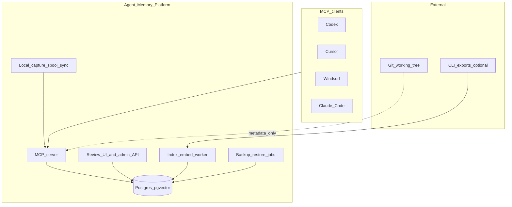
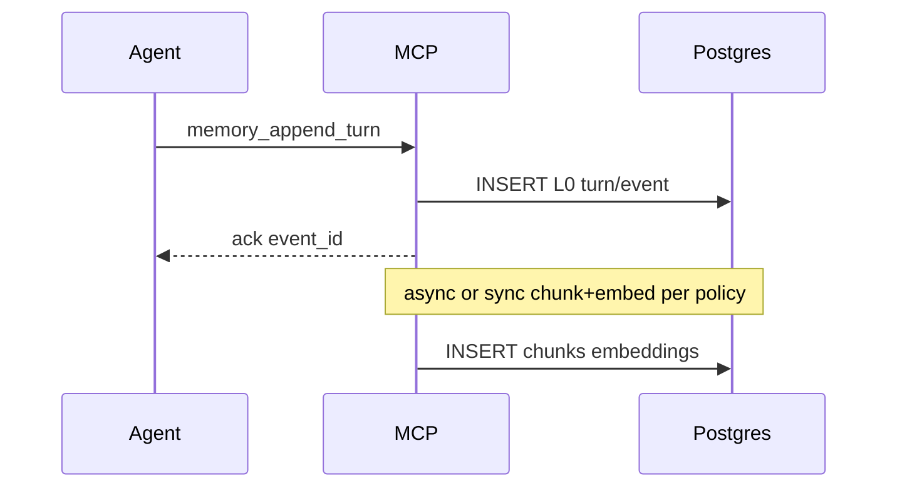
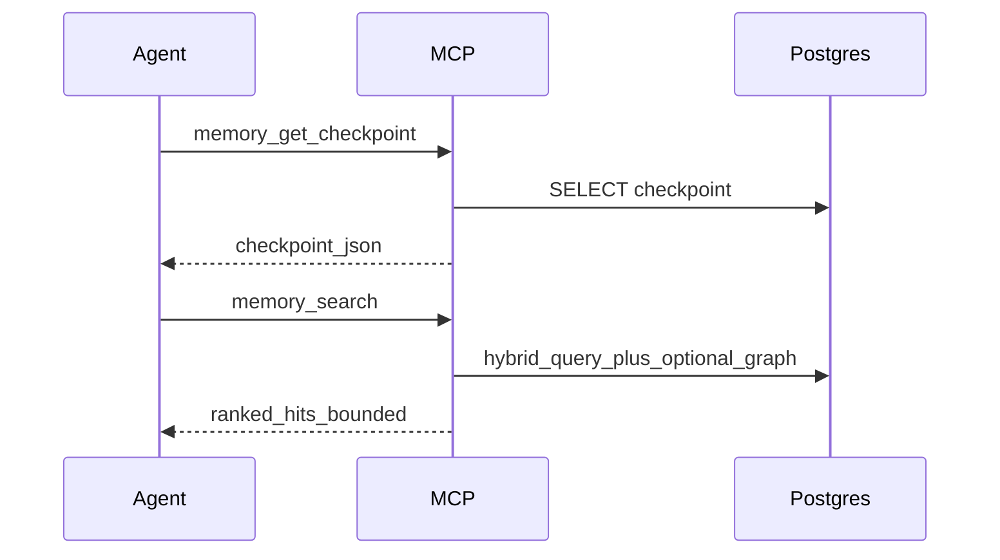
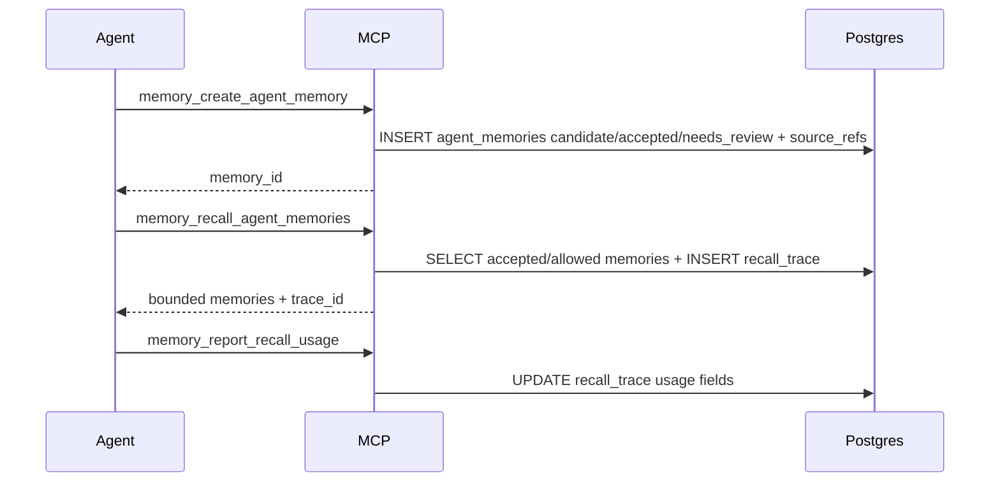
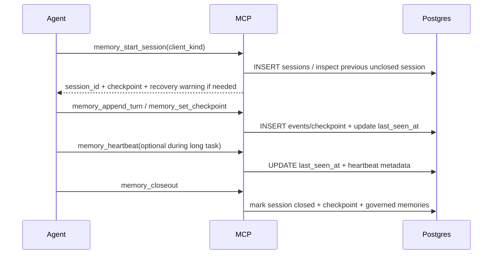
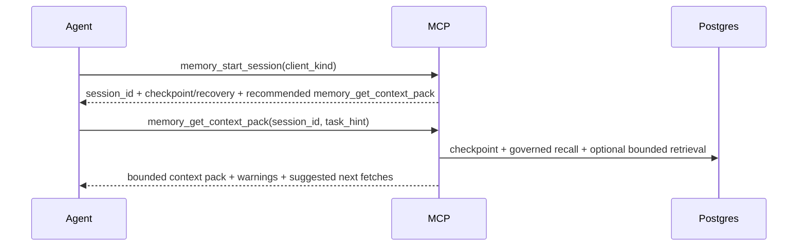

# Architecture

## 0. Current architecture bias

AMP uses **Open Brain / OB1 as the preferred architectural foundation**: Postgres/pgvector, remote MCP, multi-client memory, and governed agent-memory sidecars are the default starting point. This is a working direction, not a claim that every OB1 detail should be copied unchanged.

The accepted direction is now an **OB1/MF0 synthesis**: OB1 supplies the governance backbone, while MF0 supplies important workbench/raw-capture/Memory Tree/Keeper ideas. AMP owns the integration layer: managed hybrid capture, raw workflow evidence, project capture profiles, Review UI, context budget, and local-server-first deployment. See [ADR-0018-ob1-mf0-synthesis.md](ADR-0018-ob1-mf0-synthesis.md) and [ADR-0027-raw-workflow-evidence-foundation.md](ADR-0027-raw-workflow-evidence-foundation.md).

Other reviewed systems remain active inputs:

- MemPalace for verbatim capture, hooks/sweep, temporal KG, hybrid retrieval, and recovery posture.
- MF0-1984 for workbench/Memory Tree UX, graph hygiene, keeper pipelines, and export/import patterns.
- OpenMemory for salience/decay/reinforcement, temporal facts, connectors, and explainable recall traces.
- Journey / Journey Kits for packaging reusable workflows, install targets, preflight checks, resolver hints, shared context, and outcome/learning loops.

See [ADR-0004-ob1-as-preferred-foundation.md](ADR-0004-ob1-as-preferred-foundation.md), [ADR-0018-ob1-mf0-synthesis.md](ADR-0018-ob1-mf0-synthesis.md), and [UPSTREAM_INTEGRATION.md](UPSTREAM_INTEGRATION.md).

Codex is the first adapter and tested workflow, but AMP is not Codex-specific. The core MCP tools, session lifecycle, closeout, recovery, storage, and Review UI are universal. See [ADR-0019-universal-mcp-core-codex-adapter-session-recovery.md](ADR-0019-universal-mcp-core-codex-adapter-session-recovery.md).

Review UI runs on the AMP server. v1 uses a compact private workbench, not a minimal approval table, and the architecture should let it grow into a fuller management platform and later be exposed through a dedicated Cloudflare-managed subdomain if the owner chooses. See [ADR-0020-review-ui-on-amp-server-management-platform-path.md](ADR-0020-review-ui-on-amp-server-management-platform-path.md) and [ADR-0033-compact-review-ui-workbench-in-v1.md](ADR-0033-compact-review-ui-workbench-in-v1.md).

Settings live centrally on the AMP server. Project repositories keep only pointer/config files; effective policy is resolved from session/project/developer/server settings. v1 exposes a controlled Settings UI for project workflow settings while keeping sensitive/server settings read-only or confirmation-gated. See [ADR-0022-centralized-settings-on-amp-server.md](ADR-0022-centralized-settings-on-amp-server.md), [ADR-0034-controlled-settings-ui-in-v1.md](ADR-0034-controlled-settings-ui-in-v1.md), and [SETTINGS.md](SETTINGS.md).

Model routing is local-first, subscription-first, and API-last with a configurable provider portfolio. The baseline profile uses local Ollama models for routine work, active-agent/subscription-backed routes for stronger reasoning where available, and OpenAI/Gemini/Claude paid API routes only after explicit approval by default. See [ADR-0023-baseline-model-portfolio-and-provider-switching.md](ADR-0023-baseline-model-portfolio-and-provider-switching.md), [ADR-0031-subscription-first-api-last-model-escalation.md](ADR-0031-subscription-first-api-last-model-escalation.md), [ADR-0032-paid-api-confirmation-and-cost-dashboard.md](ADR-0032-paid-api-confirmation-and-cost-dashboard.md), and [MODEL_ROUTING.md](MODEL_ROUTING.md).

Startup context is built automatically by the server-side Context Pack Builder through `memory_get_context_pack`, not by a manual UI button. See [ADR-0024-automatic-startup-context-pack-builder.md](ADR-0024-automatic-startup-context-pack-builder.md) and [CONTEXT_BUDGET.md](CONTEXT_BUDGET.md).

Environment discovery and portability are first-class architecture requirements. AMP must model server/project/secret/connector reality as configurable facts, not hard-coded paths, and must support export/restore/remapping when moving to another server. See [ADR-0038-environment-discovery-and-portable-instance.md](ADR-0038-environment-discovery-and-portable-instance.md).

Import workflow is discovery-first and import-by-confirmation. `amp discover` finds candidates, `amp init` registers/configures projects and suggests imports, and `amp import` performs explicit preview/dry-run/write flows. See [ADR-0039-v1-import-workflow.md](ADR-0039-v1-import-workflow.md) and [IMPORT_POLICY.md](IMPORT_POLICY.md).

Memory applicability uses a multi-axis scope/audience model: `scope_kind`/`scope_id` define where a memory applies, `audience` defines who may consume it, and `use_policy` defines authority. Conflict resolution applies applicability, authority, scope specificity, and recency in that order. See [ADR-0040-memory-scope-and-audience-model.md](ADR-0040-memory-scope-and-audience-model.md) and [ADR-0041-conflict-resolution-priority.md](ADR-0041-conflict-resolution-priority.md).

Scope boundary is explicit: v1 is the full working coding-agent memory core; broader personal-life capture, external connectors, specialized storage systems, and public packaging are future expansion paths. See [ADR-0025-v1-core-and-expansion-boundary.md](ADR-0025-v1-core-and-expansion-boundary.md).

Implementation is not authorized yet. Architecture documentation remains the current deliverable; see [ADR-0009-documentation-first-before-implementation.md](ADR-0009-documentation-first-before-implementation.md).

## 1. System context

## 2. Component responsibilities

| Component | Responsibility |
|-----------|----------------|
| **MCP server** | Единственный обязательный **agent-facing** интерфейс v1: tools из `MCP_SPEC.md`, authz к `project_id`, validation, bounded responses, governed memory policy enforcement. |
| **Postgres** | SoT: L0 events/turns/workflow evidence metadata, raw artifact pointers, L1 chunks/embeddings, L2 edges, L3 governed agent memories, checkpoints, recall traces. Миграции версионируются. |
| **Index/embed worker** | Асинхронная обработка: chunking, embedding, rerank (если не inline), переиндексация. Может быть в процессе MCP (v1 simplest) или отдельном процессе (preferred при нагрузке). |
| **Review UI + admin API** | Required owner-facing v1 surface for governed-memory review: inbox, rules, detail/source refs, duplicates, conflicts, and review actions. It must use the same policy path as MCP/CLI actions. It also hosts the required Cost / Paid API dashboard. Broader observability/admin dashboards remain optional. |
| **Management UI path** | Starts as Review UI + Cost / Paid API dashboard on AMP server; can later expand into private management surfaces for projects, capture profiles, sessions/recovery, sync/spool state, model routing, and other admin functions. |
| **Auth/access layer** | Private-by-default access control for Review UI/admin API/remote MCP: localhost/Tailnet bind by default, AMP auth/session/token, secret isolation, and Cloudflare-ready routing without public exposure by default. |
| **Settings service** | Resolves effective settings from session overrides, project settings, developer/global defaults, server settings, and built-in defaults; exposes inspected effective settings to UI/CLI/MCP policy paths. |
| **Context Pack Builder** | Server-side startup context builder used by agents automatically after `memory_start_session`; composes checkpoint, rules, governed memories, recovery state, optional evidence, and next-fetch hints under context policy. |
| **Backup/restore jobs** | Create Postgres/raw-artifact backups, write manifests, support encrypted local target first, allow future second-server replication, and verify restore into temporary DB/location. |

## 3. Data flow (write path)

Политика sync/async для embedding фиксируется в `AGENT_IMPLEMENTATION_GUIDE.md` фазой 1; по умолчанию v1: **sync minimal** (возврат `event_id` сразу, chunk pipeline в той же транзакции или следом с явным статусом `pending_embed`).

## 4. Data flow (read path)

## 4.1 Governed memory path

Policy lives in the MCP server, not in the client prompt. The server must prevent agent-generated records from silently becoming instruction-grade memory.

## 4.2 Session lifecycle and recovery

If the agent stops before `memory_closeout`, the next `memory_start_session` surfaces the unclosed session and last durable state. Hybrid heartbeat improves long-task status but is not required for basic clients. This is core AMP behavior, not a Codex-only feature.

## 4.3 Startup context pack

This is the normal startup path. CLI/UI may preview the same pack, but they must not implement a separate context-selection algorithm.

## 5. Multi-project routing

- Каждый MCP session должен знать `project_id` (через env `AMP_PROJECT_ID` или параметр конфигурации клиента).
- Запрещено смешивать `project_id` в одном query без явного параметра (defense in depth).
- `projects.parent_project_id` поддерживает nested projects/workspaces, но default search остаётся scoped to current project unless explicitly widened.
- `memory_domain` позволяет будущую personal-memory expansion не смешивать с coding-agent memory by accident.
- Project boundaries are not secrecy boundaries for the owner's current workflow. They are relevance boundaries: cross-project search is allowed when explicitly requested, but default recall should not pollute the active project context.

## 5.1 Deployment posture

Default target is the owner's Linux server:

- AMP server and one Postgres/pgvector instance run on the server.
- Storage follows [ADR-0011-postgres-instance-domain-databases.md](ADR-0011-postgres-instance-domain-databases.md): v1 uses `amp_agent_work`; future major domains get separate databases in the same Postgres instance.
- Local/self-hosted embeddings are the default path.
- GPU can be used for background embedding, consolidation, review assistance, or local rerank.
- External LLM providers are optional enrichment paths, not required for core append/search.
- Local spool/offload is part of the target deployment posture so work can continue during server/network outages and sync later.
- Large workflow evidence can be offloaded through raw artifact pointers; v1 may use local/server filesystem storage, while object storage remains a later evolution path.
- Review UI is hosted on the AMP server as a private management surface. Future Cloudflare/subdomain access is allowed by architecture but requires explicit deployment/security configuration.

See [DEPLOYMENT_TOPOLOGY.md](DEPLOYMENT_TOPOLOGY.md), [STORAGE_STRATEGY.md](STORAGE_STRATEGY.md), and [MODEL_ROUTING.md](MODEL_ROUTING.md).

## 5.2 Context budget

AMP must not solve memory loss by stuffing more files into the prompt. Startup context comes from thin repo files plus the server-built context pack, which may include checkpoint, governed memory recall, recovery warnings, and narrow evidence. See [CONTEXT_BUDGET.md](CONTEXT_BUDGET.md).

## 6. Threat boundaries

Кратко: см. `SECURITY.md`. Архитектурно MCP server — **единая точка** для ACL по `project_id` и rate limits.

## 7. Evolution paths (non-v1)

- Separate object storage, vector DB, or graph DB are **not v1 architecture**. Add only by ADR if measured data volume, latency, or graph traversal needs justify the operational cost.
- Broader personal-life memory, passive capture, external productivity connectors, visual Memory Tree/workbench, public packaging, and multi-user/SaaS features are future expansion paths, not part of first implementation scope.
