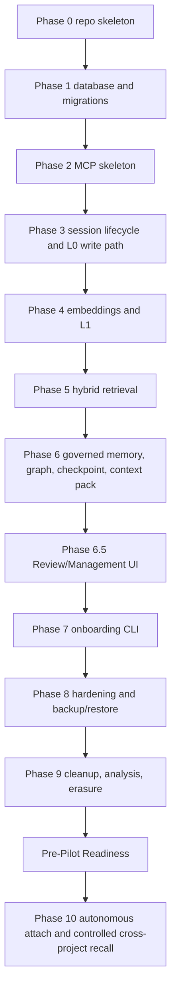

# Task graph

This file defines implementation dependencies between phases from [AGENT_IMPLEMENTATION_GUIDE.md](AGENT_IMPLEMENTATION_GUIDE.md).

Critical path: `0 -> 1 -> 2 -> 3 -> 4 -> 5 -> 6 -> 6.5 -> 7 -> 8 -> 9 -> Pre-Pilot -> 10`. All phases are required for the v1 core and first product-grade attach workflow.

Phase 3 includes universal session lifecycle, hybrid heartbeat, interruption recovery metadata, L0 append, and raw workflow evidence/artifact pointers.

Phase 6 includes governed agent memory, graph, checkpoint, Context Pack Builder, conflict handling, and erasure policy path because these depend on checkpoint, governed memories, retrieval budgets, and data model support.

Phase 6.5 includes the required Review/Management UI: inbox, rules, detail, duplicates, conflicts, Cost / Paid API, Settings, cleanup/forget, and natural-language management chat.

Phase 8 includes security hardening plus practical backup/restore verification.

Phase 9 depends on Phase 5 for retrieval decay/scoring and Phase 8 for hardened destructive/erasure paths.

Pre-Pilot Readiness was the launch-readiness plan after the deployed implementation slice. It
prepared existing-project discovery, explicit import, Review UI import/action handling, sandbox pilot
workflow, agent onboarding contract, and operational checks before any real working project is
attached. See [PRE_PILOT_READINESS.md](PRE_PILOT_READINESS.md).

Phase 10 is the next product-readiness layer after the first copied-project pilot. It composes the
safe lower-level workflow into `recallant attach --mode manual|guided|autopilot`, adds governed
detach/delete, and makes controlled cross-project recall explicit. See
[AUTONOMOUS_ATTACH.md](AUTONOMOUS_ATTACH.md) and [CROSS_PROJECT_RECALL.md](CROSS_PROJECT_RECALL.md).

Phase 10 implementation order:

1. `recallant attach` with `manual`, `guided`, and default `autopilot`.
2. governed detach/cleanup.
3. controlled cross-project recall.
