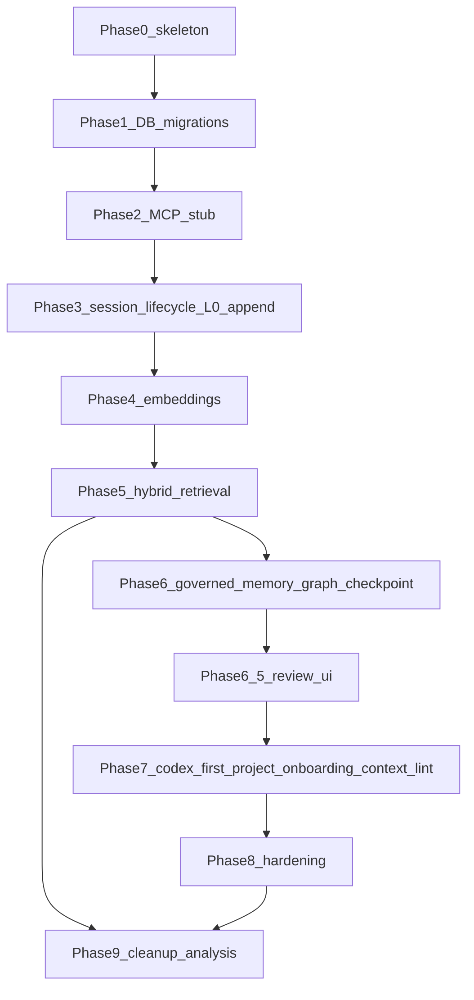

# Task graph (dependencies)

Критический путь: `0 → 1 → 2 → 3 → 4 → 5 → 6 → 6.5 → 7 → 8 → 9`. Все фазы обязательны для v1 core. Phase 3 включает universal session lifecycle, hybrid heartbeat, interruption recovery metadata, L0 append, and raw workflow evidence/artifact pointers. Phase 6 включает governed agent memory, graph и checkpoint; Phase 6.5 включает required Review UI; neither is an optional layer.

Phase 6 also includes the Context Pack Builder because it depends on checkpoint, governed memories, and retrieval budgets. Phase 8 includes hardening plus practical backup/restore verification. Phase 9 зависит от Phase 5 (retrieval pipeline для decay) и Phase 8 (hardening завершён).

Future expansion work from [ADR-0025-v1-core-and-expansion-boundary.md](ADR-0025-v1-core-and-expansion-boundary.md) is intentionally outside this critical path.
